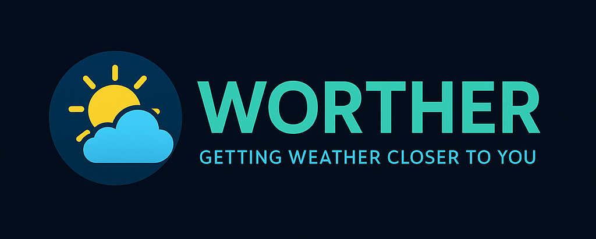

Created as a student project using [OpenStreetMap API](https://wiki.openstreetmap.org/wiki/API), [OpenWeather API](https://openweathermap.org/api) & [Rainviewer API](https://www.rainviewer.com/api.html), all of which are free to use.

Tools used: [React](https://reactjs.org/), [React Leaflet](https://react-leaflet.js.org/), [React Router](https://reactrouter.com/en/main), [React Icons](https://react-icons.github.io/react-icons), React Papaparse, React Select, [Axios](https://axios-http.com/docs/intro), [Tailwind CSS](https://tailwindcss.com/)

This project has helped me understand the basics of React, calling APIs in React, how to use the React Router efficiently and how to organise files in React

### Donations are accepted as these help contribute to more development in the future:

 

